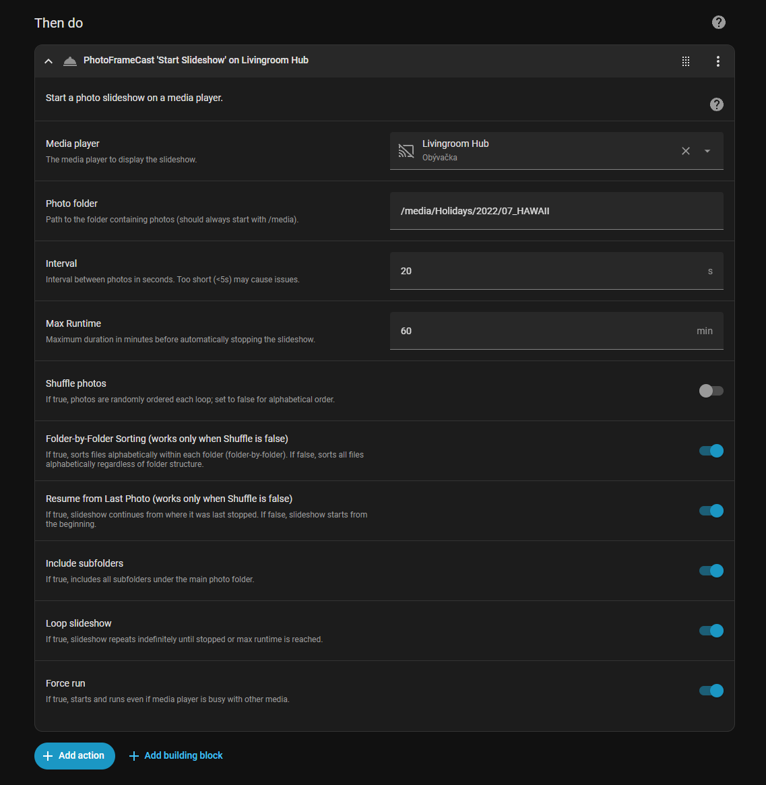

### PhotoFrameCast [](https://github.com/hacs/integration)
**A Home Assistant custom integration for casting photo slideshows to media players or browsers, perfect for digital photo frames.**

PhotoFrameCast is a custom integration that turns any Home Assistant-compatible media player (like a Chromecast, Google Nest Hub or Android/Google TV) into a digital photo frame. It provides services to start, stop, and manage dynamic photo slideshows from local media folders.


<br>

### Features
* **Dynamic Slideshows:** Casts a continuous slideshow of images to your chosen media player.
* **Flexible Options:** Customize your slideshow with settings for:
    * **Interval:** Control the duration each photo is displayed.
    * **Shuffle:** Randomize photo order for a fresh experience with each loop.
    * **Recursion:** Include photos from all subfolders.
    * **Looping:** Have the slideshow repeat endlessly.
    * **Max Runtime:** Automatically stop the slideshow after a set time.
    * **Resume Support:** Resume a slideshow from where it left off, perfect for players that power on and off.
* **Easy Automation:** All of these options can be easily configured and selected via the Home Assistant UI when creating automations or scripts.
* **"Photo of the Day":** A dedicated service to display a single random photo for a specific duration.
* **Web-Based Slideshows:** View a slideshow directly in any browser, independent of media players. Supports shuffle, loop, folder sorting, and optional auto-restart for kiosks or always-on displays.
* **Conflict Management:** Intelligently handles conflicts by waiting for or overriding other media sessions.

<br>

### ⚠️ Important Prerequisite
The PhotoFrameCast integration relies on Home Assistant's built-in web server to serve image files from your local storage. For this to work, the directory containing your photos must be accessible.

While the `http` integration is often included by `default_config:`, it is important to explicitly define the `media_dirs` option if your photos are not in the standard `/media` folder, or if you are using a more custom setup.

To ensure your photos are accessible, verify that your `configuration.yaml` file includes a configuration like this:

```yaml
# configuration.yaml
homeassistant:
  media_dirs:
    media: /media/your_photo_folder
````

This ensures your photo directory is exposed to the Home Assistant web server, which is required for casting the images.

---

### Installation

#### HACS (Recommended)

This integration is compatible with HACS (Home Assistant Community Store).

1. Open the HACS panel in your Home Assistant instance.
2. Go to **Integrations**.
3. Click on the three dots in the top right corner and select **Custom repositories**.
4. Enter the URL for this repository `https://github.com/nowocain/photoframecast` and select the category **Integration**.
5. Click **ADD**.
6. You should now see "PhotoFrameCast" in the HACS Integrations list. Click on it and then click **DOWNLOAD**.
7. Add the following line to your `configuration.yaml` file to expose the services:

   ```yaml
      photoframecast:
   ```
8. Restart Home Assistant to complete the installation.

#### Manual Installation

1. Navigate to your Home Assistant `custom_components` directory. If it doesn't exist, create it.
2. Create a new folder named `photoframecast` inside `custom_components`.
3. Copy all the files from the `custom_components/photoframecast` folder in this repository into your new folder.
4. Add the following line to your Home Assistant `configuration.yaml` file to expose the services:

   ```yaml
      photoframecast:
   ```
5. Restart Home Assistant to complete the installation.

---

### Services

Once installed, PhotoFrameCast exposes several new services you can use in automations, scripts or the Developer Tools panel.

#### `photoframecast.start_slideshow`

Starts a photo slideshow on a specified media player.

| Field         | Description                                                                  | Type      | Default      |
| :------------ | :--------------------------------------------------------------------------- | :-------- | :----------- |
| `entity_id`   | The media player to display the slideshow.                                   | `string`  | **required** |
| `folder`      | Path to the folder containing photos (must start with `/media`).             | `string`  | `/media`     |
| `interval`    | The duration each photo is displayed in seconds.                             | `integer` | `5`          |
| `max_runtime` | Maximum duration in minutes before stopping the slideshow. `0` is unlimited. | `integer` | `720`        |
| `shuffle`     | Randomize the order of photos.                                               | `boolean` | `true`       |
| `recursive`   | Include photos from subfolders.                                              | `boolean` | `true`       |
| `loop`        | Restart the slideshow after all photos have been shown.                      | `boolean` | `true`       |
| `resume`      | Continue from the last photo displayed (only works if `shuffle` is `false`). | `boolean` | `true`       |
| `force`       | Override a busy media player and start the slideshow immediately.            | `boolean` | `true`       |

**Example Automation:**

```yaml
alias: Start Slideshow
description: ""
triggers:
  - trigger: time
    at: "20:00:00"
conditions: []
actions:
  - action: photoframecast.start_slideshow
    metadata: {}
    data:
      folder: /media/Holidays/2022/07_HAWAII
      shuffle: false
      sort_folder_by_folder: true
      recursive: true
      loop: true
      force: true
      interval: 20
      resume: true
      max_runtime: 60
      entity_id: media_player.livingroom_hub
mode: single
```



#### `photoframecast.stop_slideshow`

Stops any active slideshow on a specified media player. This is the recommended way to explicitly stop a running slideshow to ensure resources are properly cleaned up.

| Field       | Description                                | Type      | Default      |
| :---------- | :----------------------------------------- | :-------- | :----------- |
| `entity_id` | The media player to stop the slideshow on. | `string`  | **required** |
| `turn_off`  | Turn off the media player after stopping.  | `boolean` | `true`       |

#### `photoframecast.reset_resume`

Resets the resume index for one or all media players, ensuring the next slideshow starts from the beginning.

| Field       | Description                                                               | Type     | Default        |
| :---------- | :------------------------------------------------------------------------ | :------- | :------------- |
| `entity_id` | The media player to reset the resume index for. Leave blank to reset all. | `string` | `(resets all)` |

#### `photoframecast.photo_of_the_day`

Displays a single, randomly chosen photo for a set duration.

| Field         | Description                                                      | Type      | Default      |
| :------------ | :--------------------------------------------------------------- | :-------- | :----------- |
| `entity_id`   | The media player to display the photo.                           | `string`  | **required** |
| `folder`      | Path to the folder containing photos (must start with `/media`). | `string`  | `/media`     |
| `max_runtime` | The duration the photo is displayed in seconds.                  | `integer` | `60`         |
| `recursive`   | Include photos from subfolders.                                  | `boolean` | `true`       |
| `force`       | Override a busy media player.                                    | `boolean` | `true`       |

#### `photoframecast.start_webslideshow`

Starts a **web-based slideshow** viewable in a browser.

| Field                   | Description                                                                                                                                   | Type      | Default  |
| :---------------------- | :-------------------------------------------------------------------------------------------------------------------------------------------- | :-------- | :------- |
| `folder`                | Path to folder containing photos (must start with `/media`).                                                                                  | `string`  | `/media` |
| `interval`              | Seconds between photos.                                                                                                                       | `integer` | 5        |
| `shuffle`               | Randomize photo order.                                                                                                                        | `boolean` | true     |
| `recursive`             | Include subfolders.                                                                                                                           | `boolean` | true     |
| `loop`                  | Repeat slideshow after all photos are shown.                                                                                                  | `boolean` | true     |
| `sort_folder_by_folder` | Sort photos folder by folder.                                                                                                                 | `boolean` | true     |
| `auto_restart`          | Keep slideshow running if it stops unexpectedly (useful for kiosks). Only works while Home Assistant is running; does not survive HA restart. | `boolean` | false    |
| `force`                 | Start slideshow even if other sessions are active.                                                                                            | `boolean` | true     |

#### `photoframecast.stop_webslideshow`

Stops a currently running web slideshow and cancels auto-restart if enabled.

| Field   | Description                                                    | Type      | Default |
| :------ | :------------------------------------------------------------- | :-------- | :------ |
| `force` | Stop slideshow immediately, even if other sessions are active. | `boolean` | true    |

**Access in browser:**

```
http://<home_assistant_ip>:8123/api/photoframecast/webslideshow
```

---

### How Options Work Together

The `start_slideshow` service's options combine to create the final photo list and its display order. The key is to understand the hierarchy of these options.

#### 1. Recursive: The First Step

The `recursive` option is evaluated first.

* **`recursive: true`**: The integration searches for photos in the main `folder` and all its subfolders. This is how the complete list of available photos is generated.
* **`recursive: false`**: The integration only looks for photos directly inside the specified `folder`.

#### 2. Shuffle: The Override

The `shuffle` option determines the primary sorting logic for the entire photo list generated in the first step.

* **`shuffle: true`**: The entire list of photos is completely randomized. Any other sorting options, such as `sort_folder_by_folder` or `resume`, are **ignored**. The slideshow will always start from a new, random position and order.
* **`shuffle: false`**: The photos are not randomized. This allows the other sorting and resume options to take effect.

#### 3. Shuffle, Sort & Resume: The Details

If `shuffle` is `false`, the `sort_folder_by_folder` and `resume` options define the specific, non-random order of the slideshow.

| shuffle     | resume            | sort\_folder\_by\_folder | Photo Display Order                                    |
| :---------- | :---------------- | :----------------------- | :----------------------------------------------------- |
| **`true`**  | `true` or `false` | `true` or `false`        | Randomized, ignores resume & sort.                     |
| **`false`** | **`true`**        | `true`                   | Resume from last photo, folder-by-folder alphabetical. |
| **`false`** | **`true`**        | `false`                  | Resume from last photo, full list alphabetical.        |
| **`false`** | **`false`**       | `true`                   | Start from first photo, folder-by-folder alphabetical. |
| **`false`** | **`false`**       | `false`                  | Start from first photo, full list alphabetical.        |

---

### Troubleshooting

* **Slideshow delay**: Large photo folders may take seconds to minutes to load. The slideshow starts automatically once the list is ready.
* **Large Photo Library**: Use a mounted network share to reduce local storage usage.
* **No photos found**: Check folder path and `media_dirs` configuration; ensure HA can read the files (`.jpg`, `.jpeg`, `.png`).
* **"Failed to cast URL..." or "slideshow aborted"**: Media player must support `play_media` for images.
* **Slideshow stops unexpectedly**: Could be network interruption, media player ending session, or `max_runtime` setting.
