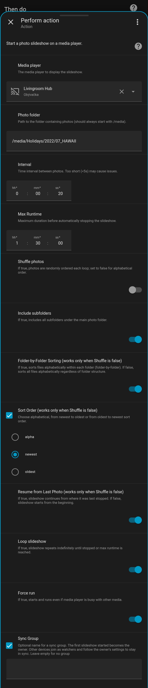

### PhotoFrameCast

**A Home Assistant custom integration for casting photo slideshows to chromecast media players, perfect for digital photo frames.**

PhotoFrameCast is a custom integration that turns any Home Assistant-compatible media player (like Chromecast, Google Nest Hub or Android/Google TVs) into a digital photo frame. It provides services to start, stop and manage dynamic photo slideshows from LOCAL media folders.

 <br>

### Features

* **Dynamic Slideshows:** Casts a continuous slideshow of images to your chosen media player.
* **Flexible Options:** Customize your slideshow with settings for:

  * **Interval:** Control the duration each photo is displayed.
  * **Shuffle:** Randomize photo order for a fresh experience with each loop.
  * **Recursion:** Include photos from all subfolders.
  * **Looping:** Have the slideshow repeat endlessly.
  * **Max Runtime:** Automatically stop the slideshow after a set time.
  * **Resume Support:** Resume a slideshow from where it left off, perfect for players that power on and off.
  * **Sorting Options:**
    Choose `sort_order` between alphabetical, newest-first or oldest-first ordering. Combine with `recursive` and `sort_folder_by_folder` for precise control.
* **Group Synchronization:** Start synchronized slideshows on multiple chromecast media players. One device acts as the owner, others follow its slideshow options like folder path, interval, duration, shuffle, sort order...
* **Pause & Resume:** Pause an active slideshow on any device (or group) and resume later without losing track.
* **"Photo of the Day":** A dedicated service to display a single random photo for a specific duration.
* **Web-Based Slideshows:** View a slideshow directly in any browser, independent of media players. Supports shuffle, loop, folder sorting, and optional auto-restart for kiosks or always-on displays.


---
### ⚠️ Prerequisite
The PhotoFrameCast integration relies on Home Assistant's built-in web server to serve image files from your local storage. For this to work, the directory containing your photos must be accessible.

While the `http` integration is often included by `default_config:`, it is important to explicitly define the `media_dirs` option if your photos are not in the standard `/media` folder, or if you are using a more custom setup.

To ensure your photos are accessible, verify that your `configuration.yaml` file includes a configuration like this:

```yaml
# configuration.yaml
homeassistant:
  media_dirs:
    media: /media/your_photo_folder
````

This ensures your photo directory is exposed to the Home Assistant web server, which is required for casting the images.

---

### Installation

#### HACS (Recommended)

This integration is compatible with HACS (Home Assistant Community Store).

1. Open the HACS panel in your Home Assistant instance.
2. Go to **Integrations**.
3. Click on the three dots in the top right corner and select **Custom repositories**.
4. Enter the URL for this repository `https://github.com/nowocain/photoframecast` and select the category **Integration**.
5. Click **ADD**.
6. You should now see "PhotoFrameCast" in the HACS Integrations list. Click on it and then click **DOWNLOAD**.
7. Add the following line to your `configuration.yaml` file to expose the services:

   ```yaml
      photoframecast:
   ```
8. Restart Home Assistant to complete the installation.

#### Manual Installation

1. Navigate to your Home Assistant `custom_components` directory. If it doesn't exist, create it.
2. Create a new folder named `photoframecast` inside `custom_components`.
3. Copy all the files from the `custom_components/photoframecast` folder in this repository into your new folder.
4. Add the following line to your Home Assistant `configuration.yaml` file to expose the services:

   ```yaml
      photoframecast:
   ```
5. Restart Home Assistant to complete the installation.

---
### Services

Once installed, PhotoFrameCast exposes several new services you can use in automations, scripts or the Developer Tools panel.

#### `photoframecast.start_slideshow`

Starts a photo slideshow on a specified media player.

| Field                   | Description                                                                      | Type      | Default      |
| :---------------------- | :------------------------------------------------------------------------------- | :-------- | :----------- |
| `entity_id`             | The media player to display the slideshow.                                       | `string`  | **required** |
| `folder`                | Path to the folder containing photos (must start with `/media`).                 | `string`  | `/media`     |
| `interval`              | The duration each photo is displayed.                                            | `integer` | `5`          |
| `max_runtime`           | Maximum duration before stopping the slideshow. `0` is unlimited.                | `integer` | `720`        |
| `shuffle`               | Randomize the order of photos.                                                   | `boolean` | `true`       |
| `recursive`             | Include photos from subfolders.                                                  | `boolean` | `true`       |
| `loop`                  | Restart the slideshow after all photos have been shown.                          | `boolean` | `true`       |
| `resume`                | Continue from the last photo displayed (only works if `shuffle` is `false`).     | `boolean` | `true`       |
| `force`                 | Override a busy media player and start the slideshow immediately.                | `boolean` | `true`       |
| `sort_order`            | Choose the sort order: `alpha`, `newest` or `oldest`.                            | `string`  | `alpha`      |
| `sort_folder_by_folder` | When `true`, photos are sorted folder-by-folder rather than globally.            | `boolean` | `false`      |
| `sync_group`            | Name of a sync group. Multiple devices in the same group will stay synchronized. | `string`  | `null`       |

**Example Automation:**

```yaml
alias: Start Evening Slideshow
description: ""
triggers:
  - trigger: time
    at: "20:00:00"
    weekday:
      - mon
      - tue
      - wed
      - thu
      - fri
conditions: []
actions:
  - action: photoframecast.start_slideshow
    metadata: {}
    data:
      folder: /media/Holidays/2022/07_HAWAII
      interval:
        hours: 0
        minutes: 0
        seconds: 20
      max_runtime:
        hours: 1
        minutes: 30
        seconds: 0
      shuffle: false
      recursive: true
      sort_folder_by_folder: true
      sort_order: newest
      resume: true
      loop: true
      force: true
      sync_group: ""
      entity_id: media_player.livingroom_hub
mode: single
```



---

#### `photoframecast.stop_slideshow`

Stops any active slideshow on a specified media player. For sync groups, stopping the owner will stop all devices.

| Field       | Description                                | Type      | Default      |
| :---------- | :----------------------------------------- | :-------- | :----------- |
| `entity_id` | The media player to stop the slideshow on. | `string`  | **required** |
| `turn_off`  | Turn off the media player after stopping.  | `boolean` | `true`       |

---

#### `photoframecast.pause_slideshow`

Pauses an active slideshow. For sync groups, pausing on one device pauses the entire group.

| Field       | Description                                | Type     | Default      |
| :---------- | :----------------------------------------- | :------- | :----------- |
| `entity_id` | The media player (or any member of group). | `string` | **required** |

---

#### `photoframecast.resume_slideshow`

Resumes a paused slideshow. For sync groups, resuming on one device resumes all.

| Field       | Description                                | Type     | Default      |
| :---------- | :----------------------------------------- | :------- | :----------- |
| `entity_id` | The media player (or any member of group). | `string` | **required** |

---

#### `photoframecast.reset_resume`

Resets the resume INDEX for one or all media players, ensuring the next slideshow starts from the beginning.

| Field       | Description                                                               | Type     | Default        |
| :---------- | :------------------------------------------------------------------------ | :------- | :------------- |
| `entity_id` | The media player to reset the resume index for. Leave blank to reset all. | `string` | `(resets all)` |

---

#### `photoframecast.photo_of_the_day`

Displays a single, randomly chosen photo for a set duration.

| Field         | Description                                                      | Type      | Default      |
| :------------ | :--------------------------------------------------------------- | :-------- | :----------- |
| `entity_id`   | The media player to display the photo.                           | `string`  | **required** |
| `folder`      | Path to the folder containing photos (must start with `/media`). | `string`  | `/media`     |
| `max_runtime` | The duration the photo is displayed.                             | `integer` | `60`         |
| `recursive`   | Include photos from subfolders.                                  | `boolean` | `true`       |
| `force`       | Override a busy media player.                                    | `boolean` | `true`       |

---

#### `photoframecast.start_webslideshow`

Starts a **web-based slideshow** viewable in a browser.

| Field                   | Description                                                                                                                                   | Type      | Default  |
| :---------------------- | :-------------------------------------------------------------------------------------------------------------------------------------------- | :-------- | :------- |
| `folder`                | Path to folder containing photos (must start with `/media`).                                                                                  | `string`  | `/media` |
| `interval`              | Seconds between photos.                                                                                                                       | `integer` | 5        |
| `shuffle`               | Randomize photo order.                                                                                                                        | `boolean` | true     |
| `recursive`             | Include subfolders.                                                                                                                           | `boolean` | true     |
| `loop`                  | Repeat slideshow after all photos are shown.                                                                                                  | `boolean` | true     |
| `sort_folder_by_folder` | Sort photos folder by folder.                                                                                                                 | `boolean` | true     |
| `sort_order`            | Choose the sort order: `alpha`, `newest`, or `oldest`.                                                                                        | `string`  | `alpha`  |
| `auto_restart`          | Keep slideshow running if it stops unexpectedly (useful for kiosks). Only works while Home Assistant is running; does not survive HA restart. | `boolean` | false    |
| `force`                 | Start slideshow even if other sessions are active.                                                                                            | `boolean` | true     |


#### `photoframecast.stop_webslideshow`

Stops a currently running WEB slideshow and cancels auto-restart if enabled.

| Field   | Description                                                    | Type      | Default |
| :------ | :------------------------------------------------------------- | :-------- | :------ |
| `force` | Stop slideshow immediately                                     | `boolean` | true    |

**Access in browser:**

```
http://<home_assistant_ip>:8123/api/photoframecast/webslideshow
```

---

### Group synchronization
Synchronize a photo slideshow across multiple Chromecast devices using the sync_group parameter in the start_slideshow service.

When you initiate a slideshow with a specific sync_group name, that device becomes the owner of the group. Any other device that starts a slideshow with the same sync_group name will join as a watcher, automatically mirroring the owner's slideshow content and timing.

If the sync_group parameter is omitted or left empty, the slideshow will play only on the specified device, and no synchronization will occur.

You can set up a sync group in two ways:

* Call the photoframecast.start_slideshow service for all devices simultaneously, using the same unique sync_group name.

* Start the slideshow on the owner device first, and then subsequently start the slideshow on watcher devices with the same sync_group name.

The owner device dictates all primary slideshow settings, including folder, interval, max_runtime, shuffle, recursive, sort_folder_by_folder, sort_order, resume, and loop.

For watcher devices, these settings are disregarded, as they inherit them from the owner. Only the entity_id, sync_group, and force parameters are relevant when a watcher joins an existing group.

**Example Automation:**

```yaml
alias: Evening sync slideshow
triggers:
  - at: "18:00:00"
    trigger: time
actions:
  - action: photoframecast.start_slideshow
    metadata: {}
    data:
      folder: /media/Holidays/2022/07_HAWAII
      interval:
        hours: 0
        minutes: 0
        seconds: 30
      max_runtime:
        hours: 1
        minutes: 30
        seconds: 00
      shuffle: false
      recursive: false
      sort_folder_by_folder: true
      sort_order: alpha
      resume: true
      loop: true
      force: true
      sync_group: evening_group
      entity_id: media_player.livingroom_hub
  - action: photoframecast.start_slideshow
    metadata: {}
    data:
      folder: /media/rpi4_usb/test_order2
      interval:
        hours: 0
        minutes: 0
        seconds: 10
      max_runtime:
        hours: 0
        minutes: 5
        seconds: 0
      shuffle: true
      recursive: true
      sort_folder_by_folder: true
      sort_order: oldest
      resume: false
      loop: true
      force: false
      sync_group: evening_group
      entity_id: media_player.sony_xr_65a80l
    enabled: true
  - action: photoframecast.start_slideshow
    metadata: {}
    data:
      folder: /media
      interval:
        hours: 0
        minutes: 0
        seconds: 5
      max_runtime:
        hours: 12
        minutes: 0
        seconds: 0
      shuffle: false
      recursive: false
      sort_folder_by_folder: false
      sort_order: alpha
      resume: true
      loop: false
      force: false
      sync_group: evening_group
      entity_id: media_player.bedroom_hub
    enabled: true
```
---

### How Options Work Together

The `start_slideshow` service's options combine to create the final photo list and its display order. The key is to understand the hierarchy of these options.

#### 1. Recursive: The First Step

The `recursive` option is evaluated first.

* **`recursive: true`**: The integration searches for photos in the main `folder` and all its subfolders. This is how the complete list of available photos is generated.
* **`recursive: false`**: The integration only looks for photos directly inside the specified `folder`.

#### 2. Shuffle: The Override

The `shuffle` option determines the primary sorting logic for the entire photo list generated in the first step.

* **`shuffle: true`**: The entire list of photos is completely randomized. Any other sorting options, such as `sort_folder_by_folder`, `sort_order` or `resume` are **ignored**. The slideshow will always start from a new, random position and order.
* **`shuffle: false`**: The photos are not randomized. This allows the other sorting and resume options to take effect.

#### 3. Recursive, Sort by Folder & Sort order: The Details

Example variations with different sorting order:
| recursive | sort\_folder\_by\_folder | sort\_order | Behavior                                                                                                                    |
| --------- | ------------------------ | ----------- | --------------------------------------------------------------------------------------------------------------------------- |
| False     | False (ignored)          | alpha       | Files in the current folder only, sorted alphabetically.                                                                    |
| False     | False (ignored)          | newest      | Files in the current folder only, sorted by newest-first.                                                                   |
| False     | False (ignored)          | oldest      | Files in the current folder only, sorted by oldest-first.                                                                   |
| True      | False                    | alpha       | Collect all files from all subfolders into a single list, then sort alphabetically (global sort).                           |
| True      | False                    | newest      | Collect all files globally, then sort by newest-first (global newest-first).                                                |
| True      | False                    | oldest      | Collect all files globally, then sort by oldest-first (global oldest-first).                                                |
| True      | True                     | alpha       | Process each folder alphabetically → within each folder, sort alphabetically. (Folder A’s files before Folder B’s, etc.)    |
| True      | True                     | newest      | Process each folder alphabetically → within each folder, sort newest-first. (Folder order still alphabetical, not by time.) |
| True      | True                     | oldest      | Process each folder alphabetically → within each folder, sort oldest-first. (Folder order still alphabetical, not by time.) |

---

### Troubleshooting

* **Slideshow delays**: Large photo folders may take seconds to minutes to load. The slideshow starts automatically once the list is ready.
* **Slow photo rendering**: For smaller screens consider reducing the photos resolution / size. They should then transfer and render faster.
* **Large Photo Library**: Use a mounted network share (e.g. samba) to reduce local storage usage. Add via HA storage network options.
* **No photos found**: Check folder path and `media_dirs` configuration; ensure the photos are in supported formats (`.jpg`, `.jpeg`, `.png`).
* **"Failed to cast URL..." or "slideshow aborted"**: Media player must support `play_media` for images.
* **Slideshow stops unexpectedly**: Could be network interruption, media player ending session or check `max_runtime` setting.
* **Sync groups not stopping as expected**: Ensure you are controlling the **owner device** of the group. All group members follow the owner’s commands (except Force, Pause and Resume). Each device can be stopped but stopping owner device will stop all member's devices.
